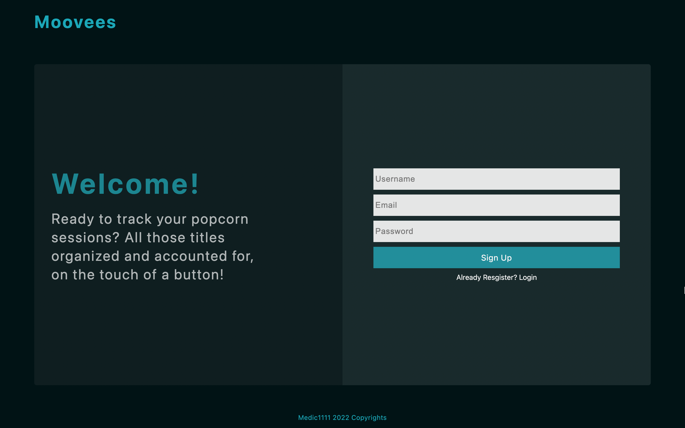

# MOOVEES-APP

[Live App Here](https://moovees-app.herokuapp.com/)

App that allows a registered user to search for movies and tv shows titles, and organize them into "wish" and "watched" lists. Current MVP.

### TEST

- Feel free to test signing up
- Alternatively:
  - username: testuser
  - password: testuser

### TECH

1. Front-end:
   - ReactJs
2. Back-end:
   - Express
   - Node.js
3. Database:
   - MongoDB
4. Extras:
   - Movies Third Party API
5. Deployment:
   - Heroku
6. Testing Tools:
   - API endpoints with REST Client Ext.
   - Reports with Postman exports
   - Test with Postman Collection Run
   - Collection Test Locally with Newman
   - Unit Testing with Jest
   - Integration with Supertest

> STATUS: MVP
> Exploring personal rating feature.

#### INSTALL

1. Download the project
2. Open the project and on the root run `npm install` then `node server/listen.js`
3. On a different terminal, run `cd client`, then `npm install` and finally `npm start`

#### LICENSE

MIT License
Copyright (c) 2022 Aryse Gabrielle Pagano

---
